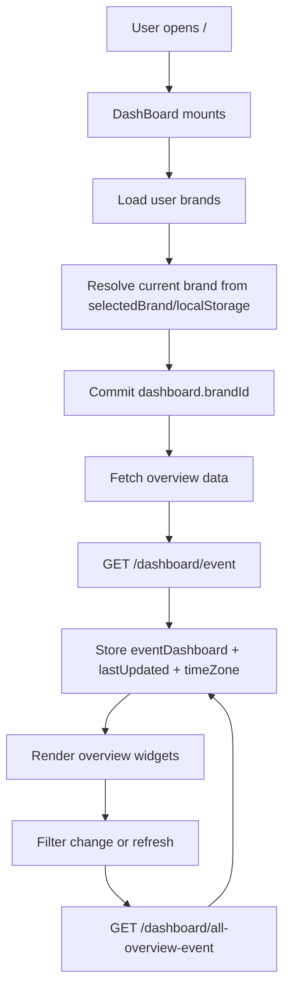

# Legacy Dashboard Overview

This document captures only the legacy `overview` dashboard from `sable-legacy`. It is intended as a migration reference for rebuilding the dashboard in `sable-latest`.

It does not cover the other legacy dashboard tabs:

- `eventTracking`
- `eventFunnel`
- `campaign`
- `loyalty`

## Scope

In `sable-legacy`, the dashboard entry route is `/` via `pages/index.vue`, which renders the top-level `DashBoard` shell.

The overview covered here is the `event` tab inside that shell:

- Route entry: `sable-legacy/pages/index.vue`
- Dashboard shell: `sable-legacy/components/DashBoard/index.vue`
- Overview container: `sable-legacy/components/DashBoard/Overall/Customer.vue`
- Main store module: `sable-legacy/store/dashboard.js`

## High-Level Flow

## Ownership And State

The overview is driven primarily by the Vuex `dashboard` module.

Important state for the overview path:

- `brandId`: active brand for the dashboard
- `tabDashboard`: active dashboard tab, with `event` meaning overview
- `filter`: shared date-range filter for overview widgets
- `filter_top_ten`: top-event chart filter
- `filter_event_created`: all-event trend filter
- `filter_frequency_of_event`: frequency heatmap filter
- `eventDashboard`: server payload used by the overview widgets
- `showLoadingEventDashboard`: global loading flag for overview widgets
- `lastUpdated`: timestamp shown near the refresh action
- `timeZone`: used to localize the latest events table timestamps
- `selectedSegment`: optional segment filter appended to overview requests

The shell initializes the dashboard by:

1. Loading the logged-in user if needed.
2. Mapping `userData.brand` into market options.
3. Resolving the active brand from `selectedBrand` or `localStorage`.
4. Saving the active `brandId`.
5. Fetching overview data when the current tab is `event`.

## Data Fetching

### Initial overview load

Initial overview data comes from `dashboard/getEventDashboard`.

Request:

- `GET /dashboard/event`

Query parameters:

- `brand_id`
- `company_id`
- `filter`
- `filter_top_ten`
- `filter_event_created`
- `filter_frequency_of_event`
- `segment_id`

Important response handling:

- `dashboard.data.data` is committed into `eventDashboard`
- `dashboard.data.last_updated` is committed into `lastUpdated`
- `dashboard.data.time_zone` is committed into `timeZone`
- `time_zone` is also mirrored into `localStorage`

### Refresh flow

Manual refresh and some filter-driven refreshes use `dashboard/refreshNewData`.

Request:

- `GET /dashboard/all-overview-event`

Query parameters:

- `brand_id`
- `company_id`
- `filter`
- `filter_top_ten`
- `filter_event_created`
- `filter_frequency_of_event`
- `segment_id`
- `is_refresh_new_data` when the user explicitly clicks refresh

### Filter behavior

The overview filter UI is owned by `components/DashBoard/Overall/Filter.vue`.

Legacy date options are:

- `7`
- `30`
- `90`
- `365`

When the date filter changes, the store updates all overview-related filter fields together:

- `filter`
- `filter_top_ten`
- `filter_event_created`
- `filter_frequency_of_event`

That means the legacy overview behaves like one top-level date control fanning out to all overview visualizations.

## Overview Layout

The overview container renders these sections in order.

### 1. Header filter and summary cards

File: `components/DashBoard/Overall/Customer.vue`

This section contains:

- the overview date filter
- a shared loading state
- four KPI cards rendered from `summaryBox`

The four top cards are derived from `eventDashboard`:

- `user_profile`
- `new_customer`
- `event`
- `segment`

These cards show totals plus trend direction/percentage where available.

### 2. Channel breakdown

File: `components/DashBoard/Overall/Channel.vue`

This section renders a doughnut chart from:

- `eventDashboard.channel.pie_label`
- `eventDashboard.channel.pie_value`

Behavior notes:

- labels are title-cased before display
- colors are assigned client-side from a fixed palette
- an empty state is shown when the summed values are zero

### 3. Funnel

Files:

- `components/DashBoard/Overall/Funnel.vue`
- `components/DashBoard/Overall/FunnelGraph.vue`

This section is presented as the overview funnel card. The wrapper is simple; the visual implementation lives in `FunnelGraph.vue`.

### 4. Summary metrics grid

File: `components/DashBoard/Overall/Summary.vue`

This section builds a variable-length grid from optional fields on `eventDashboard`. Legacy widgets appear only when the corresponding data exists.

Observed summary fields include:

- `total_send_messages`
- `total_customer_received_messages`
- `total_event_click_link`
- `percent_of_click_link`
- `journey_automation_summary`
- `all_purchase_event`
- `maximum_event_date`
- `maximum_event_time`

This means the summary area is not a fixed schema. The frontend assembles cards conditionally from the payload.

### 5. Top events

File: `components/DashBoard/Overall/TopEvent.vue`

This section renders a horizontal bar chart from:

- `eventDashboard.top_ten_all_event.bar_label`
- `eventDashboard.top_ten_all_event.bar_value`

Event labels are translated through `dashboardv2.overall.event.*`.

### 6. Event frequency heatmap

File: `components/DashBoard/Overall/FrequencyEvent.vue`

This section renders a heatmap using:

- `eventDashboard.frequency_of_event`

The card also includes a visual legend from low to high density.

### 7. All occurred events trend

File: `components/DashBoard/Overall/AllEvent.vue`

This section renders a line chart using:

- `eventDashboard.all_event_created.graph_label`
- `eventDashboard.all_event_created.graph_value`

Behavior notes:

- the chart is hidden when all values are zero
- axis step size changes based on the selected date filter
- mobile and desktop use different step sizing

### 8. Latest events table

File: `components/DashBoard/Overall/LatestEvent.vue`

This section renders the latest event rows from:

- `eventDashboard.last_ten_event`

Columns:

- date
- time
- customer id
- IP address
- event
- device
- detail

Behavior notes:

- timestamps are converted from `GMT0` into the dashboard `timeZone`
- some event types override the displayed detail field
- customer IDs link into Customer 360
- the table has its own refresh trigger, but it still uses the overview refresh path

## Brand Selection

The brand switcher sits at the dashboard shell level, not inside the overview component.

When the active brand changes in `components/DashBoard/index.vue`:

1. `dashboard/SET_BRAND_ID` is committed.
2. If the active tab is `event`, the app dispatches `dashboard/getEventDashboard`.
3. The app also checks cookie-consent installation state and may open the install modal.

This means the overview is always scoped to a selected brand before its widgets render.

## Legacy Contracts To Preserve In `sable-latest`

If the goal is parity with the legacy overview, these contracts matter more than the exact UI:

- A selected brand is required before overview data loads.
- The overview is driven by one aggregate payload, `eventDashboard`.
- The top-level filter updates all overview sub-sections together.
- The server provides `last_updated` and `time_zone`; both are part of the UX contract.
- Empty states are handled per widget, not only at the page level.
- Some summary cards are conditional and should not be treated as a fixed schema.
- The latest events table needs timezone-aware formatting.

## Suggested Mapping For `sable-latest`

The current `sable-latest/app/pages/index.vue` is only a placeholder. A practical migration path is:

1. Add a dashboard page-level composable or store for:
   - active brand
   - shared date filter
   - `eventDashboard`
   - `lastUpdated`
   - `timeZone`
   - loading and error state
2. Rebuild the legacy overview as a single page made of focused sections:
   - KPI summary cards
   - channel chart
   - funnel
   - summary metrics grid
   - top events
   - event frequency heatmap
   - all events trend
   - latest events table
3. Keep the data model close to the legacy payload first, then normalize later if needed.

## Source Files

- `sable-legacy/pages/index.vue`
- `sable-legacy/components/DashBoard/index.vue`
- `sable-legacy/components/DashBoard/Tab.vue`
- `sable-legacy/components/DashBoard/Overall/Customer.vue`
- `sable-legacy/components/DashBoard/Overall/Filter.vue`
- `sable-legacy/components/DashBoard/Overall/Channel.vue`
- `sable-legacy/components/DashBoard/Overall/Funnel.vue`
- `sable-legacy/components/DashBoard/Overall/Summary.vue`
- `sable-legacy/components/DashBoard/Overall/TopEvent.vue`
- `sable-legacy/components/DashBoard/Overall/FrequencyEvent.vue`
- `sable-legacy/components/DashBoard/Overall/AllEvent.vue`
- `sable-legacy/components/DashBoard/Overall/LatestEvent.vue`
- `sable-legacy/store/dashboard.js`
