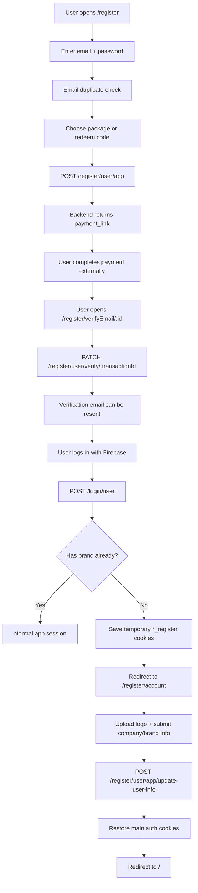

# Auth And Registration Flow

This document explains how authentication works in this repo, with focus on:

- what happens when a user registers
- what happens after payment and email verification
- what happens when a user can log in but still has no brand/company setup
- which files own each part of the flow

## Stack Summary

- Frontend: Nuxt 2 + Vuex
- Auth provider: Firebase Auth
- Backend session/user validation: Sable API via Axios
- Route protection: global Nuxt router middleware

## Main Files

- Registration state and API calls: `/store/register.js`
- Login/auth state: `/store/user.js`
- Auth middleware: `/middleware/authentication.js`
- Axios token handling and 401 behavior: `/plugins/axios.js`
- Register form: `/components/Register/Content.vue`
- Package selection and payment: `/components/Register/Plan/Card.vue`
- Payment submit: `/components/Register/SummaryPayment.vue`
- Verify email page: `/pages/register/verifyEmail/_id.vue`
- Resend verification email UI: `/components/Login/FormSendMail.vue`
- Brand/company completion page: `/components/Register/Welcome.vue`
- Login form: `/components/Login/Form.vue`

## High-Level Flow

## 1. Registration Start

The first registration page is driven by [`components/Register/Content.vue`](/Users/sable/Workspace/sable-legacy/components/Register/Content.vue).

What happens there:

1. User enters email and password.
2. The page debounces an email duplication check by calling `register/checkEmail`.
3. Optional redeem codes are validated by calling `register/redeemCode`.
4. On success, email and password are stored in Vuex with:
   - `register/SET_EMAIL`
   - `register/SET_PASSWORD`
5. The user is sent to `/register/product`.

Relevant logic:

- Email/password handoff to Vuex: [`components/Register/Content.vue`](/Users/sable/Workspace/sable-legacy/components/Register/Content.vue#L291)
- Email duplicate API check: [`store/register.js`](/Users/sable/Workspace/sable-legacy/store/register.js#L142)

## 2. Package Selection And Account Creation

On `/register/product`, the app loads packages from `GET /package-cdp` and lets the user choose monthly/annual or use redeem codes.

When the user continues:

1. Selected package is copied into Vuex.
2. `subscriptionPlan` and `packageId` are derived in `register/checkIsAnnual`.
3. The summary screen calls `register/createUser`.
4. `register/createUser` sends `POST /register/user/app`.
5. If successful, the backend returns `payment_link`.
6. The frontend redirects the browser to that external payment URL.

Important detail:

- This step does not log the user into the app.
- It creates the app user/transaction and starts the payment flow.

Relevant logic:

- Select plan and move to summary: [`components/Register/Plan/Card.vue`](/Users/sable/Workspace/sable-legacy/components/Register/Plan/Card.vue#L200)
- Create user request: [`store/register.js`](/Users/sable/Workspace/sable-legacy/store/register.js#L152)
- Redirect to payment link: [`components/Register/SummaryPayment.vue`](/Users/sable/Workspace/sable-legacy/components/Register/SummaryPayment.vue#L79)

## 3. Payment Completion And Verification Page

After payment, this app expects the user to land on `/register/verifyEmail/:id`.

That page:

1. Reads `transactionId` from the route.
2. Calls `register/validateTransaction`.
3. `register/validateTransaction` sends `PATCH /register/user/verify/:transactionId`.
4. If the transaction is valid, the page stores the email in Vuex and shows success UI.
5. The page also supports resending the verification email.

Important distinction:

- `validateTransaction` is about validating the registration/payment transaction.
- `sendEmailVerify` triggers the verification email send.

Relevant logic:

- Verify page entry: [`pages/register/verifyEmail/_id.vue`](/Users/sable/Workspace/sable-legacy/pages/register/verifyEmail/_id.vue#L20)
- Validate transaction API: [`store/register.js`](/Users/sable/Workspace/sable-legacy/store/register.js#L273)
- Resend verify email API: [`store/register.js`](/Users/sable/Workspace/sable-legacy/store/register.js#L184)
- Resend email UI: [`components/Login/FormSendMail.vue`](/Users/sable/Workspace/sable-legacy/components/Login/FormSendMail.vue#L247)

## 4. Login Flow After Verification

Login is handled in two layers:

- Firebase Auth signs the user in with email/password.
- The app then calls the backend to fetch the real app user via `POST /login/user`.

Sequence:

1. `user/logIn` calls `this.$fire.auth.signInWithEmailAndPassword(...)`.
2. Firebase tokens are written into cookies:
   - `sable.accessToken`
   - `sable.refreshToken`
   - `sable.expired_time`
3. The app immediately calls `user/getUserData`.
4. `user/getUserData` sends `POST /login/user`.
5. If backend user data is returned, Vuex `userData` is set and the session is considered logged in.

Relevant logic:

- Firebase login: [`store/user.js`](/Users/sable/Workspace/sable-legacy/store/user.js#L23)
- Backend user fetch: [`store/user.js`](/Users/sable/Workspace/sable-legacy/store/user.js#L58)
- Login page response handling: [`components/Login/Form.vue`](/Users/sable/Workspace/sable-legacy/components/Login/Form.vue#L166)

## 5. The Special "No Brand" Branch

This is the most important post-registration behavior in this repo.

Sometimes a user can authenticate successfully in Firebase, but `POST /login/user` returns `401` with message `No brand`.

That means:

- authentication is valid
- the backend knows the user
- but the user has not completed company/brand onboarding yet

When this happens in `user/getUserData`:

1. Current auth cookies are copied into temporary register cookies:
   - `sable.accessToken_register`
   - `sable.refreshToken_register`
   - `sable.expired_time_register`
2. `user/logOut` is called, which clears normal cookies/localStorage and signs out Firebase.
3. The login page detects the `No brand` response and redirects to `/register/account`.

This is a handoff from "authenticated user with incomplete onboarding" into "finish brand setup".

Relevant logic:

- Temporary cookie handoff: [`store/user.js`](/Users/sable/Workspace/sable-legacy/store/user.js#L102)
- Login page redirect to account setup: [`components/Login/Form.vue`](/Users/sable/Workspace/sable-legacy/components/Login/Form.vue#L175)
- Axios deliberately does not auto-logout on `No brand`: [`plugins/axios.js`](/Users/sable/Workspace/sable-legacy/plugins/axios.js#L42)

## 6. What Happens In `/register/account`

The account completion page is rendered from [`components/Register/Welcome.vue`](/Users/sable/Workspace/sable-legacy/components/Register/Welcome.vue).

The user fills in:

- first name
- last name
- company name
- phone number
- brand name
- website URL
- website tech format
- website maintainer
- brand logo

Then:

1. The image is uploaded with `register/uploadImage`.
2. Form values are saved into Vuex with `register/SET_USER_INFO`.
3. The app calls `register/updateUserInfo`.
4. `register/updateUserInfo` sends `POST /register/user/app/update-user-info`.
5. After success, the app reads the temporary `*_register` cookies.
6. It logs the user out again to clear transient state.
7. It writes the saved temporary cookies back into the main auth cookie names.
8. The page redirects to `/`.

This is effectively a session restore after onboarding completion.

Relevant logic:

- Submit onboarding form: [`components/Register/Welcome.vue`](/Users/sable/Workspace/sable-legacy/components/Register/Welcome.vue#L356)
- Update user info API and cookie restore: [`store/register.js`](/Users/sable/Workspace/sable-legacy/store/register.js#L225)

## 7. Route Protection

Global router middleware runs on all routes through [`middleware/authentication.js`](/Users/sable/Workspace/sable-legacy/middleware/authentication.js).

Behavior:

- If the route is protected and there is a `sable.accessToken` cookie, it tries `user/getUserData`.
- If there is no token, unauthenticated users are redirected to `/login`.
- Some registration-related routes are explicitly allowed without a normal session:
  - `/login`
  - `/resetPassword`
  - `/register`
  - `/register/verifyEmail`
  - `/register/account`
  - `/invite/:id`

Important nuance:

- `routerHelper.pathIgnoreAuthAndPermissions()` only treats `/login`, `/resetPassword`, and `/register` as public at the route-group level.
- `authentication.js` adds extra explicit exceptions for `/register/account` and `/register/verifyEmail`.

Relevant logic:

- Public/protected route split helper: [`helpers/routerHelper.js`](/Users/sable/Workspace/sable-legacy/helpers/routerHelper.js#L26)
- Middleware exceptions and redirect rules: [`middleware/authentication.js`](/Users/sable/Workspace/sable-legacy/middleware/authentication.js#L12)

## 8. Token Handling

Axios request middleware injects the bearer token from `sable.accessToken`.

If the token exists:

- Axios sets `Authorization: Bearer <token>`.
- It checks whether the token is near expiry and refreshes through Firebase if needed.

If the token does not exist:

- Axios listens to Firebase `onAuthStateChanged`.
- If a Firebase user exists, it rehydrates auth cookies from Firebase.

Relevant logic:

- Request token injection: [`plugins/axios.js`](/Users/sable/Workspace/sable-legacy/plugins/axios.js#L7)
- Expiry check: [`plugins/axios.js`](/Users/sable/Workspace/sable-legacy/plugins/axios.js#L88)

## 9. Practical Reading Order For AI

If an AI agent needs to understand or modify this flow, read files in this order:

1. [`components/Login/Form.vue`](/Users/sable/Workspace/sable-legacy/components/Login/Form.vue)
2. [`store/user.js`](/Users/sable/Workspace/sable-legacy/store/user.js)
3. [`plugins/axios.js`](/Users/sable/Workspace/sable-legacy/plugins/axios.js)
4. [`components/Register/Content.vue`](/Users/sable/Workspace/sable-legacy/components/Register/Content.vue)
5. [`components/Register/Plan/Card.vue`](/Users/sable/Workspace/sable-legacy/components/Register/Plan/Card.vue)
6. [`components/Register/SummaryPayment.vue`](/Users/sable/Workspace/sable-legacy/components/Register/SummaryPayment.vue)
7. [`pages/register/verifyEmail/_id.vue`](/Users/sable/Workspace/sable-legacy/pages/register/verifyEmail/_id.vue)
8. [`components/Login/FormSendMail.vue`](/Users/sable/Workspace/sable-legacy/components/Login/FormSendMail.vue)
9. [`components/Register/Welcome.vue`](/Users/sable/Workspace/sable-legacy/components/Register/Welcome.vue)
10. [`store/register.js`](/Users/sable/Workspace/sable-legacy/store/register.js)
11. [`middleware/authentication.js`](/Users/sable/Workspace/sable-legacy/middleware/authentication.js)

## 10. Short Answer To "What happens after user register?"

In this folder, the post-register flow is:

1. User submits email/password and selects a package.
2. Frontend creates a pending registered user through `POST /register/user/app`.
3. User is redirected to payment.
4. After payment, the app validates the transaction at `/register/verifyEmail/:id`.
5. Verification email can be sent/resend from that flow.
6. User logs in through Firebase.
7. Backend checks whether the user already has brand/company data.
8. If backend says `No brand`, the app stores temporary auth cookies and moves the user to `/register/account`.
9. User completes company/brand information.
10. The app restores the saved auth cookies and sends the user into the main app.
