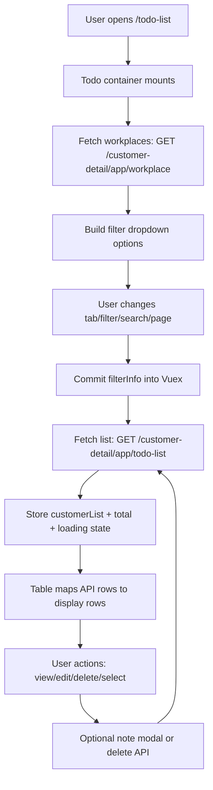

# Todo List Workflow (Legacy Reference)

This document explains how the Todo List flow works in `sable-legacy`, so it can be recreated or migrated safely in `sable-latest`.

## Scope

The legacy Todo List module is exposed at route `/todo-list` and is composed of:

- Page shell: `/Users/shaungbhone/Workspace/sable-legacy/pages/todo-list/index.vue`
- Main container: `/Users/shaungbhone/Workspace/sable-legacy/components/TodoList/index.vue`
- Tabs: `/Users/shaungbhone/Workspace/sable-legacy/components/TodoList/Tab.vue`
- Filters/header + batch actions: `/Users/shaungbhone/Workspace/sable-legacy/components/TodoList/TableHeader.vue`
- Table + row actions: `/Users/shaungbhone/Workspace/sable-legacy/components/TodoList/Table.vue`
- Bulk delete modal: `/Users/shaungbhone/Workspace/sable-legacy/components/TodoList/DeleteModal.vue`
- State owner: `/Users/shaungbhone/Workspace/sable-legacy/store/todoList.js`

## High-Level Flow

## State Model (`store/todoList.js`)

Important state:

- `customerList`: raw todo list rows from API
- `filterInfo`: server query state
  - `workplace`, `customer_priority`, `next_step`, `limit`, `skip`, `tab`, `keyword`, `total`
- `tabTodoList`: active tab (`today`, `overdue`, `upcoming`, `all`)
- `workPlaceList`: workplace options used by header filter
- Bulk selection state:
  - `selectCustomer` (customer IDs)
  - `selectCustomerId` (note IDs)
  - `deleteNoteId` (map: customer ID -> list of note IDs)
- UI state:
  - `loading`
  - `isSelectCustomer` (show batch action bar)
  - `isShowModalDelete`
- `abortController`: request cancellation for list fetches

## API Calls

### 1. Fetch todo list

- Action: `todoList/fetchTodoListInfo`
- Endpoint: `GET /customer-detail/app/todo-list`
- Query params:
  - `brand_id` (from `localStorage`)
  - `workplace`
  - `customer_priority`
  - `next_step`
  - `limit`
  - `skip`
  - `tab`
  - `keyword`

Behavior:

- Creates a new `AbortController` and aborts previous request.
- Sets `loading = true` before request.
- Saves response:
  - `filterInfo.total = fetch.data.total`
  - `customerList = fetch.data.data`

### 2. Fetch workplaces

- Action: `todoList/fetchWorkplace`
- Endpoint: `GET /customer-detail/app/workplace`
- Query params:
  - `brand_id`
  - `lang`

Used to populate the Company filter dropdown.

### 3. Bulk delete

- Action: `todoList/deleteManyNote`
- Endpoint: `PUT /customer-note/?brand_id={brandId}`
- Payload:
  - `customer_ids`
  - `note_object` (customer->note map)

After success:

- Reset selection state
- Hide bulk action state/modal
- Reset pagination to first page (`skip = 0`)
- Re-fetch todo list

## UI Workflow Details

### Tabs

Tabs are defined as `today`, `overdue`, `upcoming`, `all`.  
Changing tab dispatches `todoList/setTabTodoList`; parent component watches `tabTodoList`, commits `filterInfo.tab`, resets `skip`, and fetches list.

### Header filters and search

Header supports:

- Subject type (`next_step`)
- Priority (`customer_priority`)
- Company (`workplace`)
- Search (`keyword`, debounced 500ms)

Every filter/search change updates `filterInfo`, resets/keeps `skip` as needed, then calls `fetchTodoListInfo`.

### Pagination

- Page size is fixed at 10.
- Page change computes `skip = (page * 10) - 10`, then fetches list.
- `filterInfo.total` controls page count.

### Row-level actions

Each row supports:

- `View note` -> opens note modal in view mode
- `Open in new tab` -> opens Customer 360 route in new browser tab
- `Edit` -> opens note modal in edit mode (`customer360` store integration)
- `Delete` -> confirms, calls `customer360/deleteNote`, then refreshes todo list

### Batch selection

- Checkbox per row and select-all checkbox.
- Selection is tracked in Vuex via `addCustomerSelect`.
- If any item is selected, header switches to batch action mode:
  - `Delete` (opens bulk delete modal)
  - `Add` (opens note modal to add a note for selected customer context)

## Cross-Module Integration

Todo List is tightly integrated with `customer360` store:

- Add/Edit note from todo context can re-fetch todo list after completion.
- Deleting a single note is performed through `customer360/deleteNote`.
- Note modal state (`isShowModalNote`, edit flags, type flags) is controlled in `customer360`.

Related file:

- `/Users/shaungbhone/Workspace/sable-legacy/store/customer360.js`

## Migration Notes For `sable-latest`

- Keep request-cancel behavior for fast filter/search interactions.
- Preserve batch selection model (`customer_ids` + per-customer note map) because backend bulk delete expects this shape.
- Keep tab + filter state centralized (equivalent of legacy `filterInfo`) to avoid desync between header, table, and pagination.
- Preserve `customer360` interaction boundaries (note modal/edit actions), but isolate them behind explicit interfaces in the new architecture.
